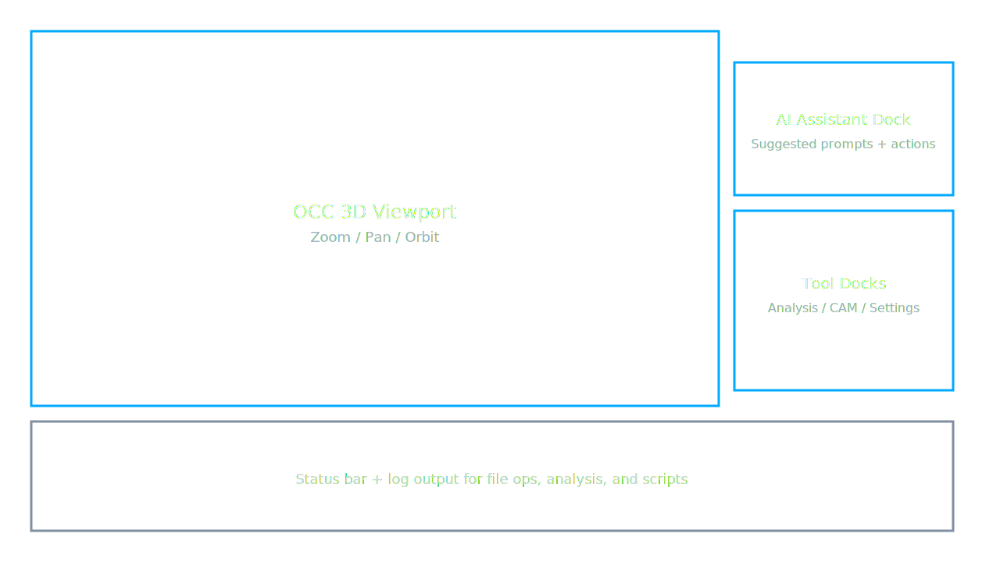
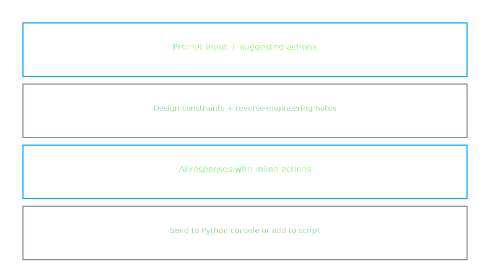
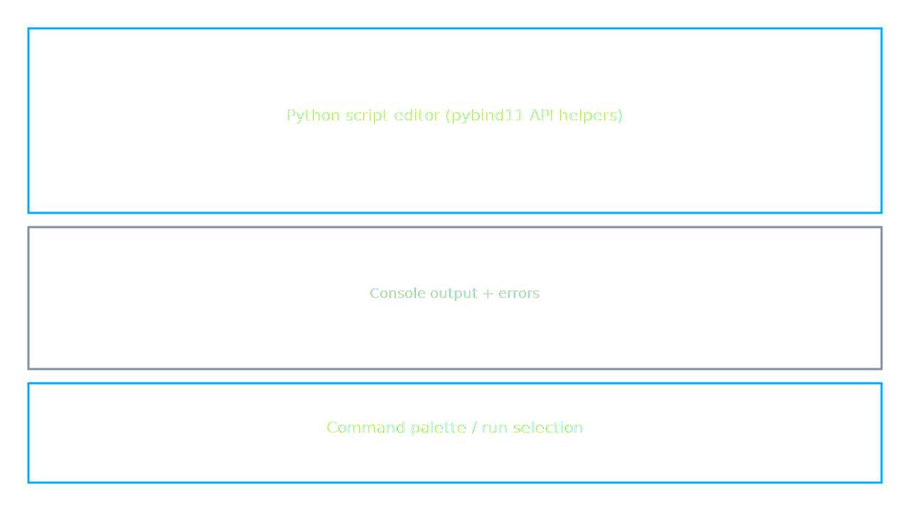
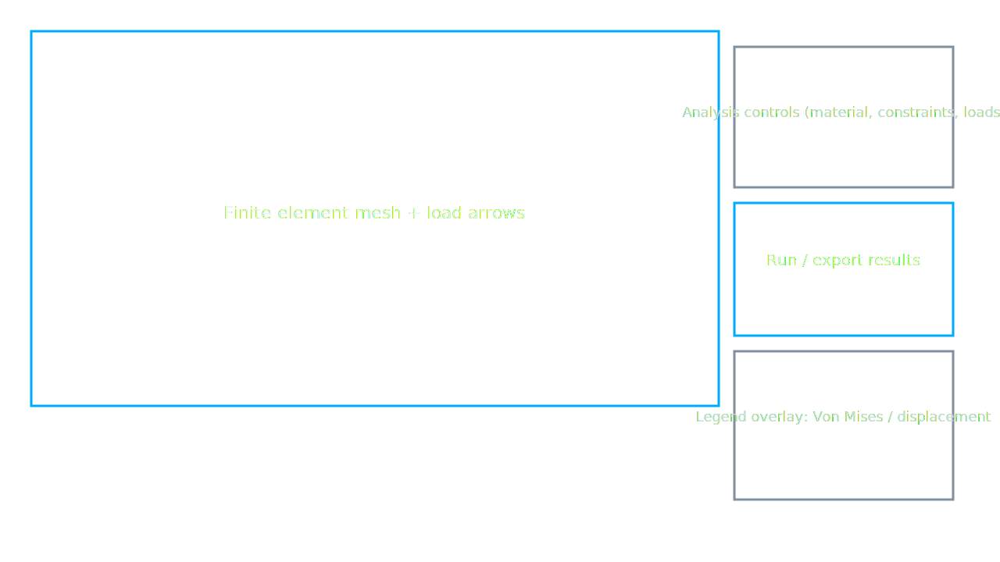

# AegisCAD 1.0

AegisCAD is a Qt 6 + OpenCascade based CAD/FEA playground that ships with a production-ready dark UI, OCC visualization, STEP/IGES I/O, glTF export, and a pybind11-driven scripting console. The 1.0 release also ships a Windows installer and reproducible CI builds for Windows (MSVC) and Ubuntu (GCC).

## Features
- Fusion-style dark UI with Segoe UI Semibold typography and tech-blue accents (`#00aaff`).
- Qt Widgets main window with OCC 3D viewport supporting zoom/pan/orbit and a sample STEP cube loaded on startup.
- STEP/IGES import/export and glTF export via OpenCascade helpers.
- AI assistant dock (rule-based) and reverse-engineering prompt dock.
- Embedded Python console powered by pybind11 (run snippets using `aegiscad.make_box`, `make_cylinder`, etc.).
- Analysis stub using a CalculiX-oriented backend and on-screen legend overlay.
- CAM dock with toolpath preview stubs and performance profiler dock for quick diagnostics.
- Configurable settings backed by `QSettings` and lightweight logging helpers.

## Build Prerequisites
- CMake 3.20+
- C++17 compiler (MSVC 2019+, GCC 11+, or Clang 12+)
- Qt 6 Widgets
- OpenCascade
- pybind11
- (Optional) OpenCV and Tesseract for enhanced AI/computer-vision features.

## Dependency Setup
- **vcpkg** (recommended on Windows): installs Qt, OpenCascade, and pybind11 in one go and provides a reusable toolchain file.
- **System packages (Ubuntu/Debian):** install `qtbase5-dev`, `libocct-*` (data-exchange, ocaf, visualization), and `pybind11-dev` from apt.
- **Python bindings:** ensure the same Python used during CMake configure is on your `PATH` so the embedded console can find the interpreter.
- **Graphics drivers:** install vendor OpenGL drivers (NVIDIA/AMD/Intel) to avoid fallback software rendering and sluggish viewports.

## Quick Build
Use the standard CMake configure/build pipeline from the repository root:

```bash
cmake -B build -S . && cmake --build build
```

## Platform Notes
### Windows (MSVC + vcpkg)
```powershell
# Install dependencies
vcpkg install qtbase opencascade pybind11

# Configure with the vcpkg toolchain
$toolchain = "$env:VCPKG_ROOT\scripts\buildsystems\vcpkg.cmake"
cmake -B build -S . -A x64 -DCMAKE_TOOLCHAIN_FILE=$toolchain -DCMAKE_BUILD_TYPE=Release
cmake --build build --config Release
ctest --test-dir build --output-on-failure --build-config Release
```

### Ubuntu (GCC)
```bash
sudo apt-get update
sudo apt-get install -y qtbase5-dev libocct-data-exchange-dev libocct-ocaf-dev libocct-visualization-dev pybind11-dev
cmake -B build -S . -DCMAKE_BUILD_TYPE=Release
cmake --build build -j
ctest --test-dir build --output-on-failure
```

### Artifact Packaging
- `cmake --install build --prefix out` installs the runnable bundle into `out/` (used by CI artifacts).
- Windows CI also runs an Inno Setup script to generate an installer alongside the zipped install tree.

## Running
The built executable lives in `build/AegisCAD` (or `build/Release/AegisCAD.exe` on Windows). Launch it to load the sample cube, then use the toolbar for STEP/glTF operations, run the analysis stub, or drive the AI/Python docks.

### Configuration
- Settings are persisted via `QSettings` under the `AegisCAD` organization key. Editing or deleting the platform-specific settings file resets the UI layout.
- The CAM/analysis docks default to stub modes; switch the backend to a real solver by updating the analysis settings page.
- Logging verbosity can be adjusted in the `Settings` dock; verbose mode mirrors messages to the on-screen log strip.

## Repository Layout
- `src/app` – application bootstrap, main window, project IO
- `src/ui` – OCC view widget, docks, and styling
- `src/cad` – geometry helpers, STEP/IGES IO, glTF export, part registry
- `src/analysis` – analysis manager and CalculiX-oriented stub backend
- `src/ai` – rule-based assistant
- `src/cam` – CAM preview stubs
- `src/scripting` – pybind11 bindings and script runner
- `src/utils` – logging, settings, JSON helpers
- `resources` – icons, sample STEP part, Qt resource collection
- `installer` – Windows Inno Setup definition used by CI
- `.github/workflows` – CI/CD pipelines for build, test, and packaging

## Quickstart Sample Project
1. Build the app (see **Quick Build**), then start `AegisCAD`.
2. Open the included STEP cube via **File → Open** and select `resources/examples/sample_part.stp`.
3. In the AI dock, choose the reverse-engineering prompt to document the part; the response buttons can populate the notes pane.
4. Open the **Python Console** dock and run `aegiscad.make_cylinder(20, 10)` to add a reference cylinder next to the cube.
5. Switch to the **Analysis** dock, set material to steel, add a fixed constraint to the base, apply a 500 N load to the top face, and click **Run Stub** to see the overlay legend update.
6. Export the updated scene to glTF via **File → Export → glTF** to share with collaborators.

## Keyboard Shortcuts Cheat Sheet
- **Ctrl+O / Ctrl+S** – Open/Save CAD projects.
- **Ctrl+Shift+E** – Export the active model as glTF.
- **Ctrl+L** – Toggle the log strip.
- **Ctrl+`** – Focus the Python console.
- **Ctrl+Alt+A** – Focus the AI assistant dock input.
- **Ctrl+Shift+R** – Run the analysis stub.
- **Ctrl+Middle Mouse / Right Mouse Drag** – Orbit the OCC viewport; **Shift+Right Drag** pans; **Scroll** zooms.

## Common Build/Run Issues
- **Qt or OCCT not found**: confirm the toolchain file or `CMAKE_PREFIX_PATH` points to your Qt and OpenCascade installs; regenerate the build directory after updates.
- **Mismatched Python**: if the embedded console fails to import modules, ensure `python3` on `PATH` matches the interpreter used when configuring CMake.
- **Slow viewport**: install hardware OpenGL drivers and run with a release build; software rendering drops frame rate significantly.
- **Missing DLLs/SOs on launch**: on Windows, run the binary from a Developer Command Prompt or bundle dependencies via `cmake --install`; on Linux, ensure `LD_LIBRARY_PATH` includes Qt/OCCT locations.
- **Installer size spikes**: clear old `build/` and `out/` directories before packaging to avoid picking up stale artifacts.

## Annotated UI Screenshots
- Main window layout

  

- AI assistant dock

  

- Python scripting console

  

- Analysis overlay and legend

  

## License
MIT License. See [LICENSE](LICENSE).
